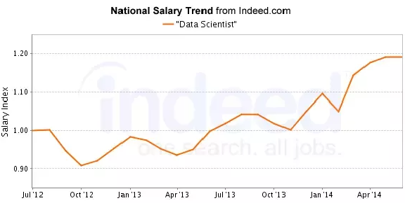
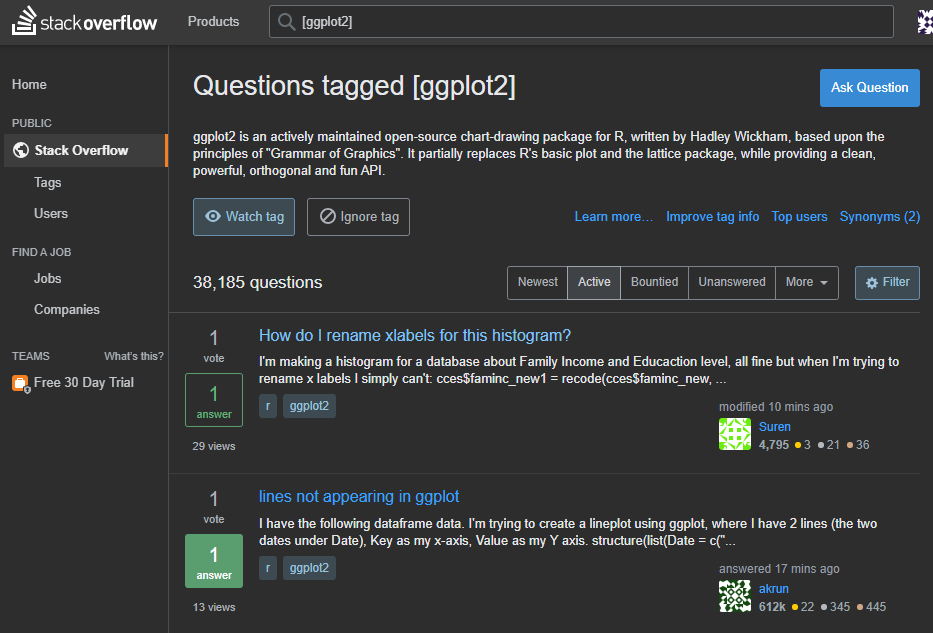
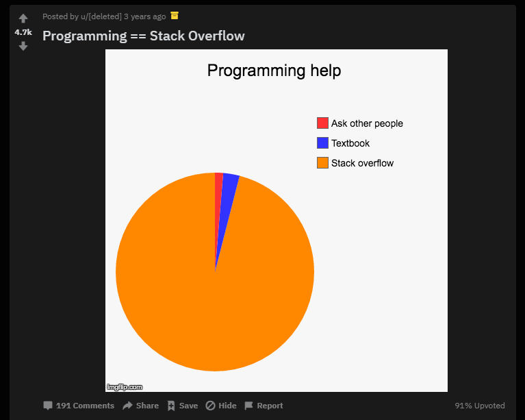
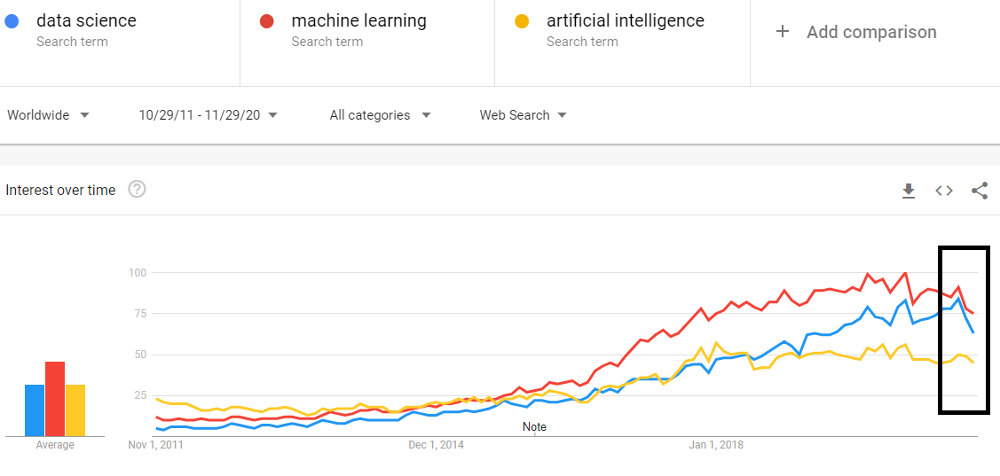
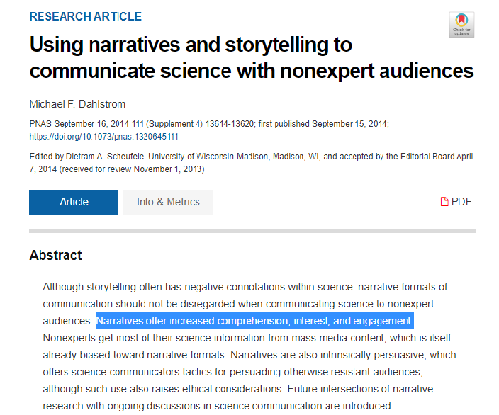
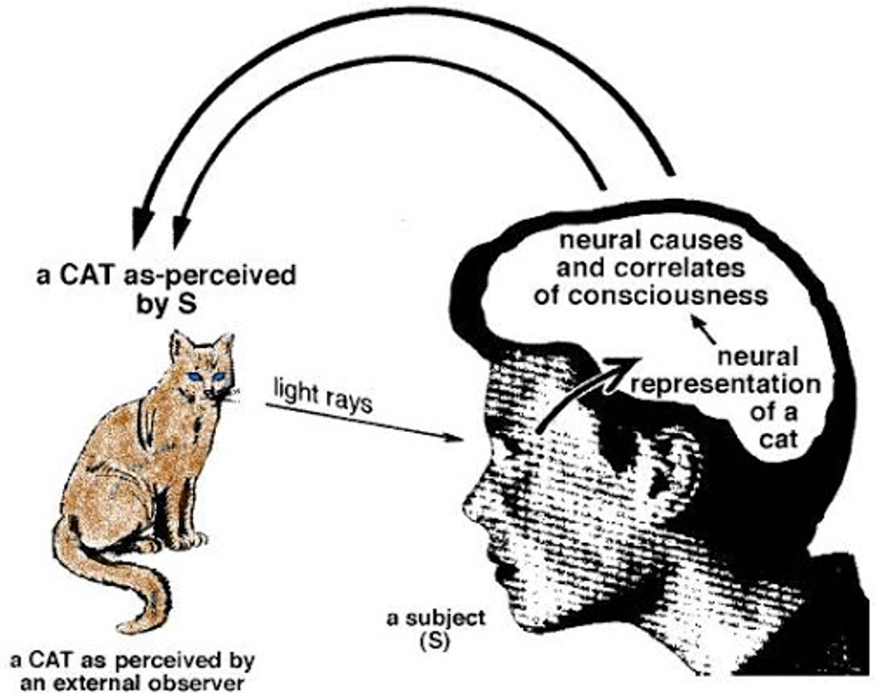
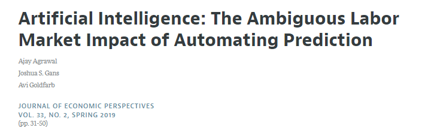
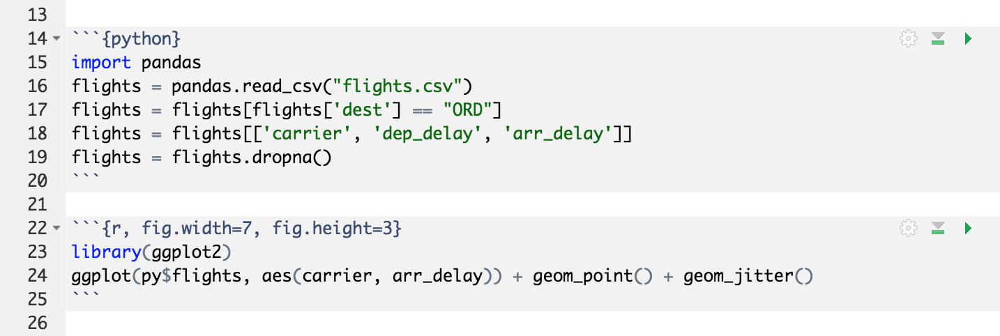

```{r setup, include=FALSE}
knitr::opts_chunk$set(echo = FALSE)
```

## Is coding valuable? 

Everybody says coding is valuable

Salaries (and framing!) **seem** to provide supporting evidence



But on the other hand...

## Is coding valuable? 
\framesubtitle{Wisdom of Crowds}

...code can just be copy-pasted from [Stack Overflow](https://stackoverflow.com/questions/tagged/r)

::: columns

:::: column



::::

:::: column



::::

:::

## Is coding valuable?
\framesubtitle{Technological advancements}

...and complex procedures can be done in a single line of code...\footnote{\url{https://www.rdocumentation.org/packages/neuralnet/versions/1.44.2/topics/neuralnet}}

```{r, echo=TRUE, eval=FALSE}
nn <- neuralnet(
  Species == "setosa" ~ Petal.Length + Petal.Width, 
  data = iris, 
  linear.output = FALSE)
```

## Is coding valuable?
\framesubtitle{zero-profit condition}

...so if there were wage premiums simply because few people knew how to code...

...over time those premiums should dissipate (especially if low-level programming can be done by AIs)



## People don't value information 

They value **stories** -- or more generally, **models** that **summarize** and **compress** information

{width=75%}

## Humans are pattern seekers



## Humans are pattern seekers


## Modeling = storytelling (with data)

People often say more information is better

But models go in the opposite direction: **throw out** information to **gain** information

For example, the estimator of the population mean:

$$
E[X] = \frac{1}{n}\sum_{i=1}^n x_i
$$

Take $n$ data points and **compress** them into one data point (the sample mean $\bar{x}$)

Ditto linear regression, logistic regression, neural nets, etc.

## You code to build models

Code itself is not valuable -- nobody pays for Stack Overflow answers

What's valuable is what code **creates** 

An app, a website -- or to the data scientist, a **model**

A model of what? 

* a model that **predicts** (e.g., "\alert{what} will people buy?")
* a model that **infers** (e.g., "\alert{why} will people buy it?")


## You build models to make decisions

And even then the model is only so valuable!



"Prediction is useful because it is an \alert{input into decision-making}. **Prediction has
no value in the absence of a decision.**"

* "\alert{what} will people buy?" $\implies$ **decide** what to make
* "\alert{why} will people buy it?" $\implies$ **decide** how to price it (or how to market it, or ...)

## Our focus

So we are here to introduce model building with R

Focus is not on "Stack Overflow questions" (i.e., nuts and bolts stuff you can get from the internet)

Focus on the `tidyverse` packages:\footnote{\url{https://www.tidyverse.org/}}

* transforming and summarizing (`dplyr`)
* visualizing (`ggplot2`)
* modeling (base R, `broom`, `modelr`)
* reproducing (RMarkdown)

## The `tidyverse`


## Why R? 

Programming languages, like spoken languages, emerge to solve communication problems

R emerged from S (Bell Labs) to make statistical programming easier\footnote{\url{https://en.wikipedia.org/wiki/R_(programming_language)}}

But unlike spoken languages, programming languages have evolved to become **complements** rather than **substitutes**

The market for programming languages is **not zero-sum**


### So why do people learn different languages? 

\scriptsize
**path dependence**: people randomly exposed to one language or another (class, friend, whatever) and anchor in it because of a) high fixed costs to learning a language and b) strong network effects of mastering one language 

\vspace{0.25cm}

**public goods problem**: who would pay the substantial cost of developing, distributing and coordinating users around a **free**, one-ring-to-rule-them-all language? (governments historically solved this problem with spoken languages -- force people to speak one language or else!)

## R ~~vs~~ and Python

R package `library(reticulate)` was designed to make it **easier** (not harder!) to use another language inside R...

...especially in **interactive notebooks** -- which is what we will use




